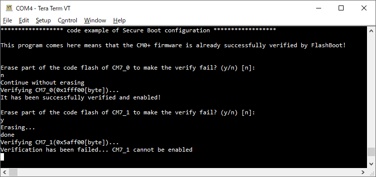

# SECURE Boot

**This code example demonstrates how to configure the firmware to Secure Boot.**  

## Device

The device used in this code example (CE) is:

- [TRAVEO™ T2G CYT4BF Series](https://www.infineon.com/cms/en/product/microcontroller/32-bit-traveo-t2g-arm-cortex-microcontroller/32-bit-traveo-t2g-arm-cortex-for-body/traveo-t2g-cyt4bf-series/)

## Board

The board used for testing is:

- TRAVEO™ T2G evaluation kit ([KIT_T2G-B-H_EVK](https://www.infineon.com/cms/en/product/evaluation-boards/kit_t2g-b-h_evk/), [KIT_T2G-B-H_LITE](https://www.infineon.com/cms/en/product/evaluation-boards/kit_t2g-b-h_lite/))

## Scope of work

In this CE, the TRAVEO™ T2G MCU's Flash Boot, which is first verified by BootROM and guaranteed secure, verifies the CM0+ firmware. After booting, the CM0+ firmware verifies the CM7_0/1 firmware and enables them only if the signatures match.

## Introduction  

**BootROM**  
The BootROM of TRAVEO™ T2G MCU supports the following features:

- After any type of reset, the boot code starts execution from ROM on the CM0+.
- The boot process consists of two parts: ROM boot process and flash boot process.
- The ROM boot code applies life-cycle stage and protection state.
- The ROM boot code validates the integrity of the flash boot process before starting it.

**Flash Boot**  
The Flash Boot of TRAVEO™ T2G MCU supports the following features:

- Secure boot support
    - Digital signature verification by RSASSA-PKCS1-v1.5 with SHA-256 and RSA1 up to 4096 bits
    - Public key in SFlash for RSA up to 4096
    - Control enabling DAP by access restrictions (AR)
- User configuration through TOC2
    - The next launched application's address and format
    - A listen window to facilitate debugging
    - Boot time and power consumption
    - Authentication options for secure applications
- Embedded CAN and LIN bootloader to replace SWD or JTAG for factory programming
    - CAN at 100 or 500 kbps
    - LIN at 20000 or 115200 bps

**Cryptography Block**  
The cryptography function block of TRAVEO™ T2G supports the following features:  

- Advanced Encryption Standard (AES) functionality according to FIPS 197:  
    - The AES component can be used to encrypt/decrypt data blocks of 128-bit length and supports programmable key length (128/192/256-bit key).
- CHACHA20 functionality according to RFC 7539:  
    - CHACHA20 is a stream cipher, which produces output consisting of 512-bit random-looking bits. These random-bits can be XORed with plain-text to produce cipher-text.
- Triple Data Encryption Standard (TDES):  
    - The TDES component can be used to encrypt/decrypt data blocks of 64-bit length using a 64-bit key.
- Secure Hash Algorithm (SHA) functionality according to FIPS 180-4/FIPS-202:  
    - This component can be used to produce a fixed-length hash (also called “message digest”) of up to 512 bits from a variable-length input data (called “message”). SHA1, SHA2, SHA3 hashes are supported.
- Cyclic Redundancy Check (CRC) functionality:  
    - This component performs a cyclic redundancy check with a programmable polynomial of up to 32-bits.
- String (STR) functionality:  
    - This component can be used to efficiently copy, set, and compare memory data.
- Pseudo Random Number Generator (PR):  
    - This component generates pseudo random numbers in a fixed range. This generator is based on three Linear Feedback Shift Registers (LFSRs).
- True Random Number Generator (TR):
    - This component generates true random numbers of up to 32 bits using ring oscillators.
- Vector Unit (VU):  
    - This component act as coprocessors to offload asymmetric key operations from the main processor.
- AHB master-interface:  
    - This allows to fetch operands directly from the system memory.
- Device Key functionality:  
    - The device key has its usage restricted to specific functionality;  
    they cannot be accessed by the software that implements that functionality. Two independent device keys are supported.

More details can be found in [Technical Reference Manual (TRM)](https://www.infineon.com/dgdl/?fileId=5546d4627600a6bc017600bfae720007), [Registers TRM](https://www.infineon.com/dgdl/?fileId=5546d4627600a6bc017600be2aef0004) and [Data Sheet](https://www.infineon.com/dgdl/?fileId=5546d46275b79adb0175dc8387f93228).

## Hardware setup

This CE has been developed for:

This CE has been developed for:
- TRAVEO™ T2G evaluation kit ([KIT_T2G-B-H_EVK](https://www.infineon.com/cms/en/product/evaluation-boards/kit_t2g-b-h_evk/)) 
 
No changes are required from the board's default settings.

- TRAVEO™ T2G Body High Lite evaluation kit ([KIT_T2G-B-H_LITE](https://www.infineon.com/cms/en/product/evaluation-boards/kit_t2g-b-h_lite/)) 
 
No changes are required from the board's default settings.

## Implementation

To keep the system in a fully secure state, the device life cycle stage must be transitioned to SECURE (or SECURE_W_DEBUG) and Supervisory Flash (SFLASH) rewriting must be prohibited. But in this CE, the life cycle stage is assumed to be NOMRMAL_PROVISIONED and describes how the contents of SFLASH are set. This CE also explain how to assign digital signatures to the CM0+ and CM7_0/1 firmware to be verified, and how to verify the CM7_0/1 firmware with the CM0+ firmware.

**TOC2 configuration**  
The TOC2 is prepared as a constant table *SFLASH_TOC2* in the *main.c* of CM0+ firmware, and must be placed at the specified address (0x17007C00) in SFLASH.  

- The type name is *SFLASH_TOC2_Type*, the table declared as *SFLASH_TOC2*
- The elements in TOC2 to keep in mind to configure a secure boot:
    - *.TOC2_FIRST_USER_APP_ADDR* Top address of the application to be verified by Flash Boot. In this CE, the top address of CM0+ firmware is specified.
    - *.TOC2_FIRST_USER_APP_FORMAT* The format of the application. To make it verified by Flash Boot, this should be set as *SI_APP_FORMAT_CYPRESS* (=1).
    - *.TOC2_SHASH_OBJECTS* This specifies the number of SFLASH areas which is verified by BootROM when the device life cycle stage is SECURE (or SECURE_W_DEBUG). To make the device secure, at least this value should be 3, the each area is public key (located at 0x17006400; specified at *.TOC2_SIGNATURE_VERIF_KEY*), SWPU objects (located at 0x17007600; specified at *.TOC2_APP_PROTECTION_ADDR*), and TOC2 itself (located at 0x17007C00).

**Asymmetric key preparation**  
The firmware proves the absence of tampering by verifying the digital signature assigned to the trailer part of the CySAF format. Since digital signatures are granted using asymmetric private keys and verified using public keys, a set of asymmetric keys must first be prepared.

- This CE uses RSA-2048 public and private keys. A batch script *rsa_keygen.bat* included in *utils* subfolder can generate the keys. This batch script uses OpenSSL which version is higher than 1.0.2 to generated RSA keyset, and also requires Python 3.x.x to convert RSA public key to table of c-source.

**Place public keys in SFLASH**  
As same as TOC2, the public key to use on verifying the firmware should also be located in the SFLASH (0x17006400). This is also prepared as a constant table *PUBLIC_KEY* in the *main.c* of CM0+ firmware, this can be copied from the output file *rsa_to_c_generated.txt* exists in *keys_generated* folder.

**Cypress Secure Application Format (CySAF) header**  
All firmware to be verified must be in CySAF format. Each core's *main.c* contains its CySAF header as a table called *CYSAF_HEADER*.

**Granting digital signatures**  
After building the project, the digital signature should be embedded to generated elf file using private key. The application *cymcuelftool.exe* in *utils* folder can achieve this, do like below at the top folder of each project:

    ../utils/cymcuelftool.exe --sign build/<kit_name>/<config_name>/<proj_name>.elf SHA256 --encrypt RSASSA-PKCS --key ../utils/keys_generated/rsa_private.txt

After executed this command, the elf file contains valid digital signature at the trailer of the CySAF format.
In this CE, this command is registered on POSTBUILD in *Makefile* of each cores.

**Booting CM0+ firmware**  
Once the elf file with the correct digital signature is flashed, the CM0+ firmware should be verified by Flash Boot and executed up to the *main()* function.

- At first the *main()* initializes UART for use as a STDIO by calling <a href="https://infineon.github.io/retarget-io/html/group__group__board__libs.html#ga21265301bf6e9239845227c2aead9293"><i>cy_retarget_io_init()</i></a> function.
    - Initialize the pin specified by CYBSP_DEBUG_UART_TX as UART TX, the pin specified by CYBSP_DEBUG_UART_RX as UART RX (these pins are connected to KitProg3 COM port)
    - The serial port parameters become to 8N1 and 115200 baud

**Verifying CM7_0/1 firmware**  
Verification by Flash Boot is performed simply by setting TOC2 and public key into SFLASH, whereas CM7_0/1 firmware verification by CM0+ firmware must be implemented by the user.

- The *main()* function of CM0+ verifies CM7_0/1 firmware by calling *Cy_FB_VerifyApplication()* function.
    - This function is not included in firmware as a symbol, fixedly placed in SFLASH. The arguments are:
      - *uint32_t address*: The start address of the data image to be authenticated
      - *uint32_t length*: The length of the data image
      - *uint32_t signature*: The start address of the signature for the data image
      - *cy_stc_crypto_rsa_pub_key_t* publicKey*: The pointer to a public key structure
    - This function returns 1 if the digital signature is valid, and 0 if invalid.
- If the verification is successfully finished, each core will be enabled by callin *Cy_SysEnableCM7()* function with their top address where the vector table exists.
- This CE also can observe the behavior of the case that the verification is failed. By selecting the CE's behavior from terminal can make it be failed.
    - Erases a part of the code flash before starting the verification to make it failed by calling <a href="https://infineon.github.io/psoc6hal/html/group__group__hal__flash.html#ga669e3789204d0cf9610a85f26a28c55b"><i>cyhal_flash_init()</i></a>, *Cy_Flashc_MainWriteEnable()* and <a href="https://infineon.github.io/psoc6hal/html/group__group__hal__flash.html#ga10b68f24a5c9a7c929a2c1fa3af89858"><i>cyhal_flash_erase()</i></a>
    - Note that after erasing the code flash and failing to verify, the verification will continue to fail until the correct firmware is rewritten.

## Run and Test

For this CE, a terminal emulator is required for displaying outputs and get inputs. Install a terminal emulator if you do not have one. Instructions in this document use [Tera Term](https://ttssh2.osdn.jp/index.html.en).

After code compilation and the digital signature addition, perform the following steps to flashing the device:

1. Connect the board to your PC using the provided USB cable through the KitProg3 USB connector.
2. Open a terminal program and select the KitProg3 COM port. Set the serial port parameters to 8N1 and 115200 baud.
3. Program the board using one of the following:
    - Select the CE project in the Project Explorer.
    - In the **Quick Panel**, scroll down, and click **[Project Name] Program (KitProg3_MiniProg4)**.
4. After programming, the CE starts automatically. Confirm that the messages are displayed on the UART terminal.

    - *Terminal output on program startup* 

5. You can debug the example to step through the code. In the IDE, use the **[Project Name] Debug (KitProg3_MiniProg4)** configuration in the **Quick Panel**. For details, see the "Program and debug" section in the [Eclipse IDE for ModusToolbox™ software user guide](https://www.infineon.com/dgdl/?fileId=8ac78c8c8386267f0183a8d7043b58ee).

**Note:** **(Only while debugging)** On the CM7 CPU, some code in *main()* may execute before the debugger halts at the beginning of *main()*. This means that some code executes twice: once before the debugger stops execution, and again after the debugger resets the program counter to the beginning of *main()*. See [KBA231071](https://community.infineon.com/t5/Knowledge-Base-Articles/PSoC-6-MCU-Code-in-main-executes-before-the-debugger-halts-at-the-first-line-of/ta-p/253856) to learn about this and for the workaround.

## References  

Relevant Application notes are:
- AN235305 - GETTING STARTED WITH TRAVEO™ T2G FAMILY MCUS IN MODUSTOOLBOX™
- [AN228680](https://www.infineon.com/dgdl/?fileId=8ac78c8c7cdc391c017d0d3e888b67e2) - Secure system configuration in TRAVEO™ T2G family

ModusToolbox™ is available online:
- <https://www.infineon.com/modustoolbox>

Associated TRAVEO™ T2G MCUs can be found on:

- <https://www.infineon.com/cms/en/product/microcontroller/32-bit-traveo-t2g-arm-cortex-microcontroller/>

More code examples can be found on the GIT repository:
- [TRAVEO™ T2G Code examples](https://github.com/orgs/Infineon/repositories?q=mtb-t2g-&type=all&language=&sort=)

For additional trainings, visit our webpage:  
- [TRAVEO™ T2G trainings](https://www.infineon.com/cms/en/product/microcontroller/32-bit-traveo-t2g-arm-cortex-microcontroller/32-bit-traveo-t2g-arm-cortex-for-body/traveo-t2g-cyt4bf-series/#!trainings)

For questions and support, use the TRAVEO™ T2G Forum:  
- <https://community.infineon.com/t5/TRAVEO-T2G/bd-p/TraveoII>  
